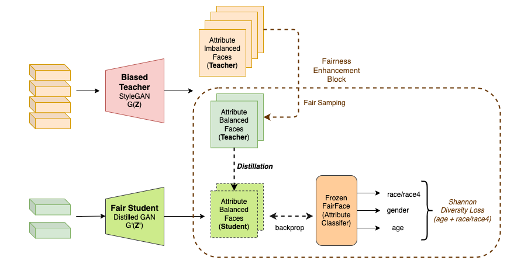
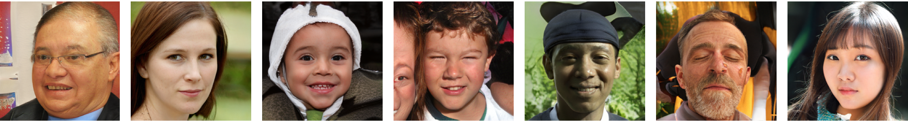
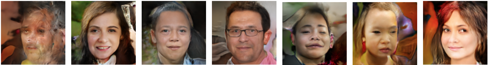
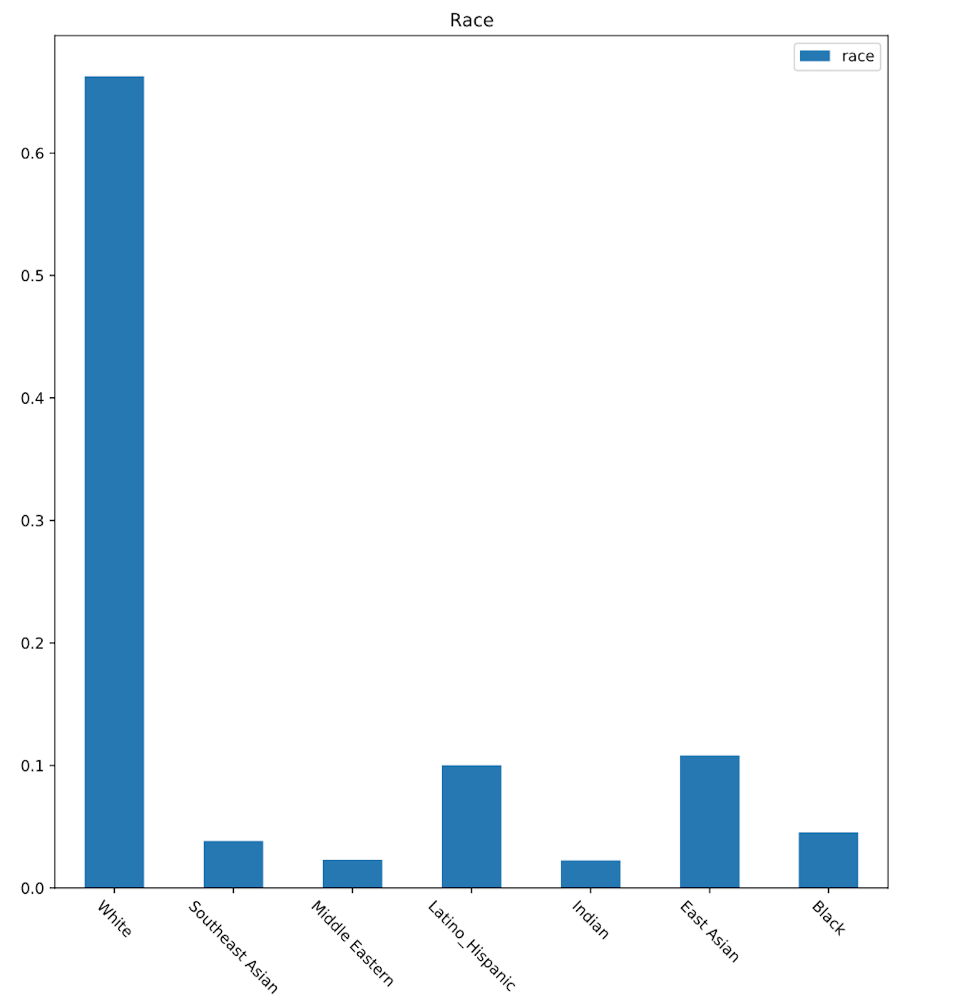
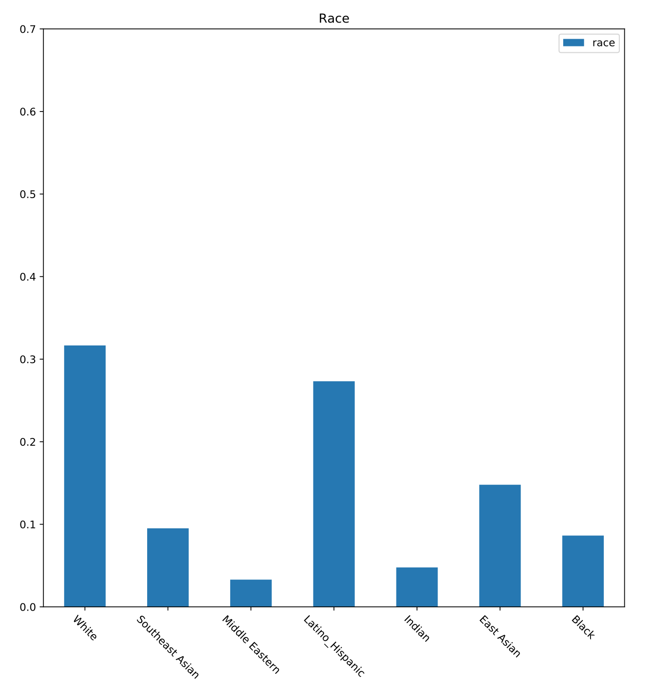
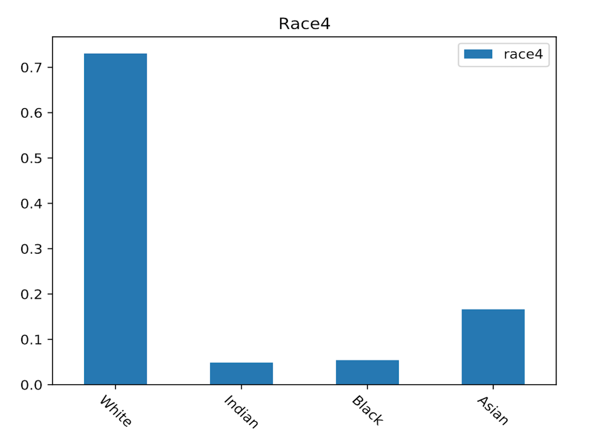
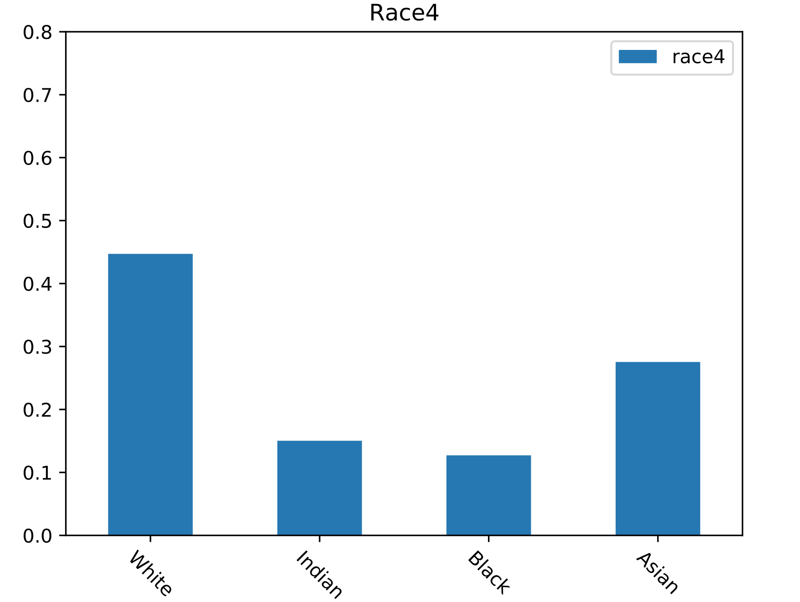

# Fair Distillation in GANs
Distillation of GANs with fairness constraints


This work is carried out as part of my Masters Thesis - ***"Bias and Fairness in Low Resolution Image Recognition"*** under the guidance of [Dr. Mayank Vatsa](http://home.iitj.ac.in/~mvatsa/) and [Dr. Richa Singh](http://home.iitj.ac.in/~richa/)

[](https://opensource.org/licenses/Apache-2.0)
[](https://www.python.org/downloads/release/python-382/)
[](https://pytorch.org/)

## Requirements:

Clone the repository
> git clone [https://github.com/ksasi/fair-distill.git](https://github.com/ksasi/fair-distill)

Install using pip

> pip install -r requirements.txt

## Datasets:

| Dataset | Description                       
| :-------- |:-------------------------------- |
| [BFW](https://github.com/visionjo/facerec-bias-bfw)|This is balanced across eight subgroups. This consists of 800 face images of 100 subjects, each with 25 face samples.The BFW dataset is grouped into ethnicities (i.e., Asian (A), Black (B), Indian (I), and White (W)) and genders (i.e., Females (F) and Males (M)) shown in (b) figure 2.2.1. The metadata for this dataset consists of list of pairs for face verification. Hence, this dataset can be used to investigate bias in automatic facial recognition (FR) system for verification protocol.|


## Architecture:

||
|:--:| 
| *Fair Distillation of GANs*|

## Experimental Setup & Evaluation:

Clone StyleGAN2-ADA repository

> git clone [https://github.com/NVlabs/stylegan2-ada-pytorch.git](https://github.com/NVlabs/stylegan2-ada-pytorch)

Clone FairFace repository

> git clone [https://github.com/dchen236/FairFace.git](https://github.com/dchen236/FairFace)

### Data

Create `alltrain`, `alltest`, `disttrain`, `disttest` folders in `<root_folder>/fair-distill/data/` location

Create `st_latents`, `te_images` and `st_images` folders in `<root_folder>/fair-distill/data/stdata` location

Generate synthetic faces from teacher GAN (StyleGAN) by executing stylegan2_generator.py in src folder under fair-distill as below :

> python stylegan2\_generator.py --num=80000 --outdir=../data/alltrain
> python generate\_csv.py --imgdir=../data/alltrain  --outdir=../results

Navigate to FairFace folder and execute scripts as below :

> rm -rf detected\_faces
> 
> python predict.py --csv \<root\_folder\>/fair-distill/results test_imgs.csv
> 
> cp test\_outputs.csv ../fairDL/results/test\_outputs\_1.csv

Sample images from `alltrain` to `disttrain` based on the attributes such that all sub-groups are balanced as below :

> python sampler.py --src=\<root\_folder\>/fair-distill/data/alltrain --tgt=\<root\_folder\>/fair-distill/data/disttrain --predfile=\<root\_folder\>/fair-distill/results/test\_outputs\_1.csv

### Distillation

Naviate to `scripts` folder and execute as shown below :

> sh run.sh

Obtain the best checkpoint of the distilled Student GAN by visual inspection of generated faces.

### Evaluation

Generate faces from the distilled Student GAN and Teacher GAN as below :

> student\_generator.py --num=5000 --stimgdir=\<root\_folder\>/fair-distill/data/stdata/st\_images --stlatdir=\<root\_folder\>/fair-distill/data/stdata/st\_latents --teimgdir=\<root\_folder\>/fair-distill/data/stdata/te\_images --model\_checkpoint=\<root\_folder\>/fair-distill/checkpoints/\<best\_student\_GAN\_checkpoint>

Generate attribute plots (**race, race4 and others**) from Student GAN generated faces as below :

> python generate\_csv.py --imgdir=\<root\_folder\>/fair-distill/data/stdata/st\_images --outdir=\<root\_folder>/fair-distill/results

> sh pred.sh

> python plot.py --src=\<root\_folder\>/fair-distill/results/img\_outputs.csv --outdir=\<root\_folder\>/fair-distill/results  


## Results:

| *Teacher GAN* |  |
|:--:|:--:|
| *Student GAN* |  |

 
|  |  |
|:--:|:--:|
| *Teacher Race* | *Student Race* |


|  |  |
|:--:|:--:|
| *Teacher Race4* | *Student Race4* |

 

## References:

1. [FairFace](https://github.com/dchen236/FairFace)
2. [TinyGAN](https://github.com/terarachang/ACCV_TinyGAN)

## How to cite this repository

If you used this repository in your work, please cite it as below:

```
@software{face-distill,
  author = {Sasikanth, Kotti},
  title = {{Fair Distillation in GANs}},
  year = {2022},
  url = {https://github.com/ksasi/fair-distill}
}
```